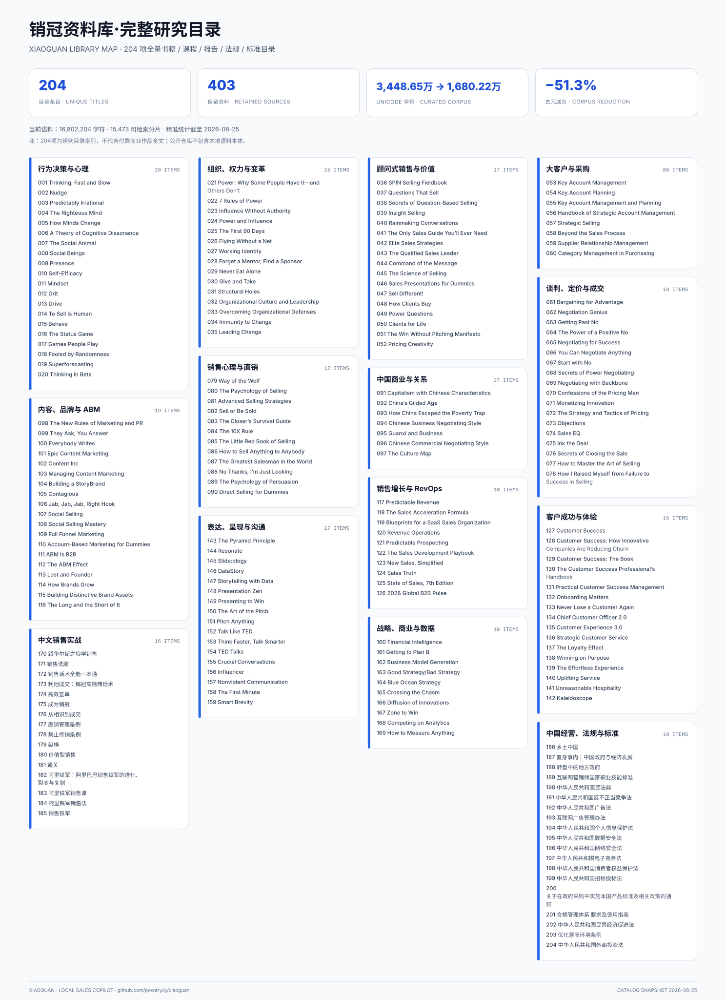
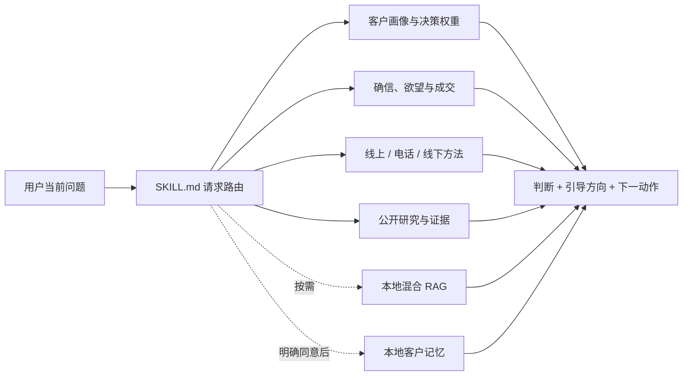

<!-- README_SYNC: source=working-tree; updated=2026-08-25 -->

<p align="center">
  简体中文 · <a href="./README_EN.md">English</a>
</p>

<h1 align="center">销冠 · Xiaoguan</h1>

<p align="center">
  面向个人与 B 端销售的本地客户军师：先判断客户心理、需求与决策权重，再给引导方向和下一成交动作。
</p>

<p align="center">
  <a href="https://github.com/powerycy/xiaoguan/stargazers"><strong>⭐ 如果销冠解决了你的实际销售问题，点亮 Star 方便收藏，也让更多销售发现它</strong></a>
</p>

<p align="center">
  <a href="https://github.com/powerycy/xiaoguan/stargazers"></a>
  <a href="https://github.com/powerycy/xiaoguan/issues"></a>
  <a href="https://github.com/powerycy/xiaoguan/commits/main"></a>
  <a href="./SKILL.md"></a>
  <a href="https://www.python.org/"></a>
</p>

## 它不是默认替你写话术

很多销售助手一上来就输出一大段“高情商话术”。销冠默认做的是另一件事：先找出客户真正卡在哪里，再告诉你应该影响哪个决策因素、建立哪一种信任、调用什么证据，以及本轮应该争取什么承诺。

只有你明确要求“话术、逐字稿、代写、直接回复、照着说或发”时，它才生成完整对客表达。

| 你问什么 | 销冠默认交付什么 |
| --- | --- |
| “这个客户是什么人？” | 决策风格、显性需求、隐性欲望、核心顾虑 |
| “什么最影响他？” | 最高的 2–3 个决策因素和第一决策按钮 |
| “应该怎么推进？” | 信任建立方向、证据任务和下一成交动作 |
| “为什么还不成交？” | 唯一高权重阻力、解除标准和真实紧迫性 |
| “帮我写一段微信” | 根据已选策略生成可直接使用的表达 |

## 核心方法

需要完整成交策略时，销冠在后台按这条路径分析：

```text
客户心理 → 显性与隐性需求 → 决策权重
→ 相信销售者 / 机构 / 产品 → 欲望与结果
→ 真实紧迫性 → 核心阻力 → 最高合理承诺
```

它不会把这条内部路径机械地变成每次回答的固定目录。用户只问一个具体问题时，就只回答那个问题；用户要完整方案时，默认压缩为五项：

1. 客户是什么人；
2. 什么影响决策；
3. 应该往哪个方向引导；
4. 如何勾起真实欲望；
5. 如何快速推进成交。

## 为什么不同

- **需求优先，而不是框架优先**：先识别用户要画像、策略、跟进、谈判、成交、复盘还是代写，不为了展示方法强行走完整漏斗。
- **心理判断有证据边界**：从客户原话和可观察行为出发，区分事实、用户判断、模型推测与未知，不用人格标签替代分析。
- **权重决定打法**：只呈现最重要的 2–3 项，不为了“专业感”编造精确百分比。
- **信任、欲望与成交连成一条线**：把销售者、机构和产品的可信证据连接到客户第一决策按钮，再处理唯一阻力。
- **紧迫性必须真实**：只有存在名额、价格调整、截止日期、供给能力或明确机会成本时才使用，不虚构稀缺。
- **默认保留销售者自己的声音**：给判断、表达任务和动作，除非明确请求，否则不代写整段话术。

## 资料库：204 项研究目录，403 份高相关资料

销冠先建立了 **204 项书籍、课程、报告、法规与标准目录**，再对本地语料做相关性精简：从 **34,486,518** 个 Unicode 字符的候选池，优化到当前 **16,802,204** 个字符，减少 **51.3%**，保留 **403** 份高相关资料，建成 **15,473** 个可检索分片。

<a href="./assets/library-catalog.svg">
  
</a>

## 快速开始

### 1. 安装 Skill

```bash
git clone https://github.com/powerycy/xiaoguan.git ~/.codex/skills/xiaoguan
```

已经安装过时：

```bash
git -C ~/.codex/skills/xiaoguan pull
```

重新打开一个 Codex 任务后，用 `$xiaoguan` 调用。

### 2. 第一次使用

```text
使用 $xiaoguan。

客户是一家制造企业的老板，已经经营 20 年，有投资需求，
但不认识我，反复问“凭什么相信你”和“亏了怎么办”。
请判断他是什么人、什么影响决策、我应该往哪个方向引导。
默认不要写话术。
```

如果你确实要一段可以直接发出的内容，再明确说明：

```text
使用 $xiaoguan。沿用刚才的判断，帮我写一段不超过 120 字的微信回复。
```

## 工作方式



## 本地客户档案（可选）

销冠提供一个基于 SQLite 的本地客户记忆工具，支持客户 01–30。它默认关闭，只有用户明确同意后才能启用；临时会话不会写入长期档案。

```bash
python3 scripts/customer_memory.py status
python3 scripts/customer_memory.py enable --confirm
python3 scripts/customer_memory.py clients
```

客户事实、互动事件和模型假设分开保存；模型推测只能进入带置信度的 `hypothesis`。工具拒绝保存私人电话、私人邮箱、住址、金融账户等敏感字段，并提供暂停、撤销、删除单个客户和清空全部数据的命令。

数据只写入本机应用数据目录，也可以通过 `XIAOGUAN_MEMORY_DIR` 改到你指定的位置。

## 本地知识库与混合 RAG（高级、可选）

仓库提供三套能力：

- `search_corpus.py`：轻量关键词检索，只依赖 Python 标准库；
- `build_hybrid_index.py`：构建 FTS5 + 中英文向量索引；
- `hybrid_search.py`：结合词法、中文向量、英文向量、销售阶段、沟通媒介和来源等级重排结果。

本仓库**不包含**本地语料、向量模型、生成后的索引或用户数据。核心销售 Skill 不依赖这些文件也可以使用；只有需要接入自己的专业知识库时才配置 RAG。

轻量检索示例：

```bash
export XIAOGUAN_CORPUS_DIR=/path/to/your/corpus
python3 scripts/search_corpus.py \
  --query "buyer trust risk sensitive 客户信任 决策权重" \
  --top-k 3 --max-chars 5000
```

混合索引需要 Python 3.10+、`numpy`、`fastembed`，以及本地可用的 `BAAI/bge-small-zh-v1.5` 和 `BAAI/bge-small-en` 模型。脚本坚持本地模型模式，不会在检索时偷偷下载模型。详细的语料路由和预算见 [knowledge-router.md](./references/knowledge-router.md)。

## 项目结构

```text
xiaoguan/
├── SKILL.md                         # 主入口、请求路由与输出规则
├── agents/openai.yaml               # Codex 界面元数据
├── assets/library-catalog.svg        # 204 项资料库全景图
├── docs/library-catalog.md           # 完整可搜索文字目录
├── references/
│   ├── decision-analysis.md         # 客户画像与决策权重
│   ├── persuasion-engine.md         # 确信、欲望、紧迫性与成交
│   ├── sales-control-and-closing.md # 主导权、异议与承诺阶梯
│   ├── online-sales.md              # 微信、邮件、电话与视频
│   ├── offline-visits.md            # 线下拜访与会议
│   ├── research-and-evidence.md     # 公开研究与事实边界
│   ├── customer-memory.md           # 本地客户档案规则
│   └── knowledge-router.md          # 混合 RAG 路由与检索预算
└── scripts/
    ├── customer_memory.py           # 同意控制的本地 SQLite 记忆
    ├── search_corpus.py             # 轻量关键词检索
    ├── build_hybrid_index.py        # 本地混合索引构建
    └── hybrid_search.py             # 混合召回与重排
```

## 适合与不适合

适合：客户判断、需求发现、陌生触达、电话或线下沟通、异议、跟进、谈判、报价、成交、续约、增购和复盘。

不适合：自动群发、替你虚构客户案例或产品优势、用假稀缺强迫成交、把模型推测当成客户事实，或在未经同意时建立客户档案。

## 当前验证状态

截至 2026-08-25，当前版本已通过：

- Skill 结构校验；
- 四个 Python 脚本的语法检查与 CLI 启动检查；
- 本地混合检索测试，正常返回 `hybrid` 模式且无警告；
- 客户记忆默认关闭、明确同意、召回和用户控制路径的静态核对。

仓库目前没有公开 CI、Release 或测试覆盖率数据，因此首页不展示这些未经验证的徽章或数字。

## 参与项目

如果你发现某类客户判断不准、销售阶段路由不合适，或有可复现的改进建议，欢迎提交 [Issue](https://github.com/powerycy/xiaoguan/issues) 或 Pull Request。请不要在 Issue 中上传真实客户姓名、联系方式、聊天全文或商业机密。

---

如果销冠对你有用，可以 [点亮 Star](https://github.com/powerycy/xiaoguan/stargazers) 收藏项目；想跟进更新可 Watch，有问题或改进建议请直接提 Issue。
