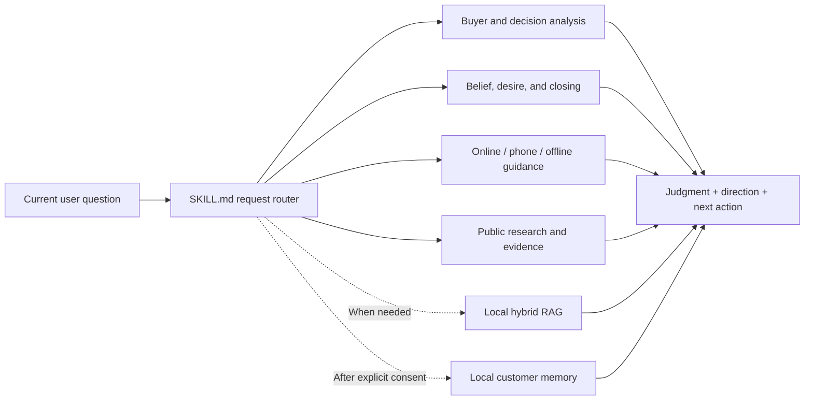

<!-- README_SYNC: source=working-tree; updated=2026-08-25 -->

<p align="center">
  <a href="./README.md">简体中文</a> · English
</p>

<h1 align="center">Xiaoguan · 销冠</h1>

<p align="center">
  A local sales copilot for individual and B2B sellers: understand buyer psychology, needs, and decision weights before choosing the next move.
</p>

<p align="center">
  <a href="https://github.com/powerycy/xiaoguan/stargazers"><strong>⭐ If Xiaoguan helps with a real sales problem, Star it for later and help other sellers discover it</strong></a>
</p>

<p align="center">
  <a href="https://github.com/powerycy/xiaoguan/stargazers"></a>
  <a href="https://github.com/powerycy/xiaoguan/issues"></a>
  <a href="https://github.com/powerycy/xiaoguan/commits/main"></a>
  <a href="./SKILL.md"></a>
  <a href="https://www.python.org/"></a>
</p>

## It does not default to writing scripts for you

Many sales assistants immediately generate a polished block of copy. Xiaoguan takes a different default: identify what is actually blocking the buyer, then tell you which decision factor to influence, what kind of trust to build, what evidence to use, and what commitment to ask for next.

It writes complete customer-facing copy only when you explicitly ask for a script, word-for-word draft, direct reply, or message ready to send.

| What you ask | What Xiaoguan delivers by default |
| --- | --- |
| “What kind of buyer is this?” | Decision style, stated need, latent desire, and main concern |
| “What will influence them most?” | The top 2–3 decision factors and the primary decision trigger |
| “How should I move this forward?” | Trust-building direction, evidence tasks, and the next sales action |
| “Why are they still not buying?” | The highest-weight blocker, its resolution test, and authentic urgency |
| “Write a WeChat reply for me” | Customer-facing copy built from the selected strategy |

## The reasoning model

For a complete deal strategy, Xiaoguan reasons through this path internally:

```text
Buyer psychology → stated and latent needs → decision weights
→ belief in the seller / company / product → desire and outcome
→ authentic urgency → primary blocker → highest reasonable commitment
```

This is an internal reasoning sequence, not a mandatory output template. A narrow question gets a narrow answer. When a full strategy is requested without a format, Xiaoguan compresses it into five decisions:

1. Who this buyer is;
2. What most affects the decision;
3. What direction to guide the conversation;
4. How to activate genuine desire;
5. How to move toward a close quickly.

## What makes it different

- **The current need comes before the framework.** Xiaoguan first detects whether the user needs analysis, strategy, follow-up, negotiation, closing, review, research, or copywriting.
- **Psychological claims need observable evidence.** Buyer statements and behavior are separated from seller judgment, model inference, and unknowns.
- **Decision weights drive the play.** Only the 2–3 factors that can change the decision are surfaced; false precision is avoided.
- **Trust, desire, and closing form one chain.** Evidence about the seller, company, and product is connected to the buyer’s primary decision trigger.
- **Urgency must be real.** Capacity, price changes, deadlines, supply constraints, or delay costs are used only when they actually exist.
- **The seller keeps their own voice.** Direction and action are the default; complete scripts require an explicit request.

## Quick start

### 1. Install the Skill

```bash
git clone https://github.com/powerycy/xiaoguan.git ~/.codex/skills/xiaoguan
```

To update an existing installation:

```bash
git -C ~/.codex/skills/xiaoguan pull
```

Open a new Codex task and invoke the Skill with `$xiaoguan`.

### 2. Try a real case

```text
Use $xiaoguan.

The buyer has run a manufacturing business for 20 years and has money to invest,
but does not know me. He keeps asking why he should trust me and what happens if
he loses money. Identify who this buyer is, what drives his decision, and how I
should guide the conversation. Do not write a script by default.
```

When you do want ready-to-send copy, say so explicitly:

```text
Use $xiaoguan. Based on the previous analysis, write a WeChat reply under 120 Chinese characters.
```

## How it works



## Local customer memory (optional)

Xiaoguan includes a local SQLite memory tool with 30 customer slots. It is off by default and can only be enabled after explicit user consent. Temporary sessions are never written to long-term memory.

```bash
python3 scripts/customer_memory.py status
python3 scripts/customer_memory.py enable --confirm
python3 scripts/customer_memory.py clients
```

Customer facts, dated events, and model hypotheses are stored separately. Model inferences are restricted to confidence-labeled `hypothesis` records. The tool rejects fields for private phone numbers, private email, home addresses, financial accounts, and other sensitive data. Pause, undo, per-customer deletion, consent revocation, and full deletion are built in.

Data stays in the operating system’s local application-data directory. Set `XIAOGUAN_MEMORY_DIR` to choose another location.

## Local knowledge and hybrid RAG (advanced, optional)

The repository ships three retrieval components:

- `search_corpus.py`: lightweight lexical search using only the Python standard library;
- `build_hybrid_index.py`: builds an FTS5 plus bilingual vector index;
- `hybrid_search.py`: reranks lexical, Chinese-vector, and English-vector results with sales stage, channel, and source-tier signals.

This repository does **not** include a corpus, embedding models, generated indexes, or customer data. The core sales Skill works without them. Configure RAG only when you want to connect your own professional knowledge base.

Lexical-search example:

```bash
export XIAOGUAN_CORPUS_DIR=/path/to/your/corpus
python3 scripts/search_corpus.py \
  --query "buyer trust risk sensitive 客户信任 决策权重" \
  --top-k 3 --max-chars 5000
```

Hybrid indexing requires Python 3.10+, `numpy`, `fastembed`, and local copies of `BAAI/bge-small-zh-v1.5` and `BAAI/bge-small-en`. Retrieval runs in local-model mode and does not silently download models. See [knowledge-router.md](./references/knowledge-router.md) for routing and retrieval budgets.

## Repository layout

```text
xiaoguan/
├── SKILL.md                         # Entry point, request routing, output rules
├── agents/openai.yaml               # Codex interface metadata
├── references/
│   ├── decision-analysis.md         # Buyer profiles and decision weights
│   ├── persuasion-engine.md         # Belief, desire, urgency, and closing
│   ├── sales-control-and-closing.md # Conversation control and objections
│   ├── online-sales.md              # Messaging, email, phone, and video
│   ├── offline-visits.md            # In-person visits and meetings
│   ├── research-and-evidence.md     # Public research and evidence boundaries
│   ├── customer-memory.md           # Local memory policy
│   └── knowledge-router.md          # Hybrid RAG routing and budgets
└── scripts/
    ├── customer_memory.py           # Consent-gated local SQLite memory
    ├── search_corpus.py             # Lightweight lexical retrieval
    ├── build_hybrid_index.py        # Local hybrid index builder
    └── hybrid_search.py             # Hybrid retrieval and reranking
```

## Good fit / not a fit

Good fit: buyer analysis, discovery, outbound, phone and in-person conversations, objections, follow-up, negotiation, pricing, closing, renewals, expansion, and deal reviews.

Not a fit: automated mass outreach, invented customer proof or product claims, fake scarcity, treating model inference as buyer fact, or building customer files without consent.

## Current verification status

As of 2026-08-25, the current version has passed:

- Skill structure validation;
- syntax and CLI startup checks for all four Python scripts;
- a local hybrid retrieval test that returned `hybrid` mode with no warnings;
- static review of memory defaults, explicit consent, recall, and user-control paths.

The project does not currently publish CI, Releases, or coverage metrics, so this README does not claim or badge them.

## Contributing

If a buyer analysis is consistently wrong, a stage is routed poorly, or you have a reproducible improvement, open an [Issue](https://github.com/powerycy/xiaoguan/issues) or submit a Pull Request. Do not include real customer names, contact details, full private conversations, or confidential business information.

## License

This repository currently has no `LICENSE` file. Do not treat it as OSI-licensed open source or as granting commercial-use rights. Any future license terms will be defined by the actual repository files.

---

If Xiaoguan is useful, [Star the repository](https://github.com/powerycy/xiaoguan/stargazers) to keep it close. Watch for updates, or open an Issue with a concrete problem or improvement.
